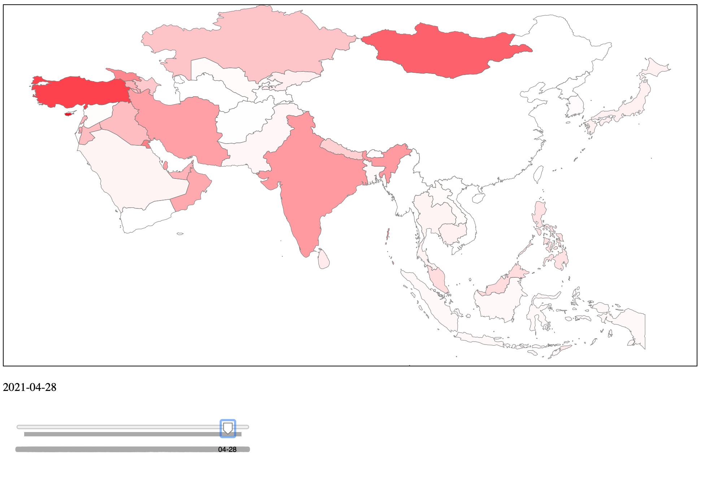

# d3-covid-over-time

Plot covid case prevalence (fraction of population) per country over time, using a slider.

(Example showing Asian countries alone)

## Run

`npm run build`

... then open `index.html`

## Makes use of

* [d3-simple-slider](https://github.com/johnwalley/d3-simple-slider)
* Data from [Our World in Data](https://github.com/owid/covid-19-data)
